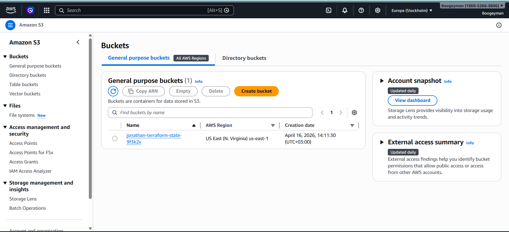
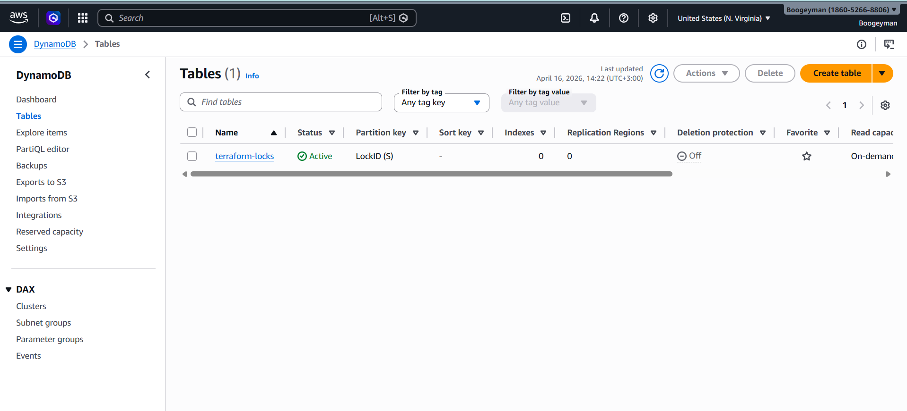
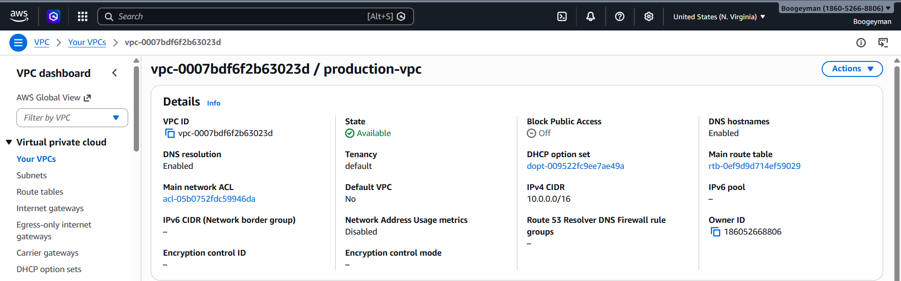
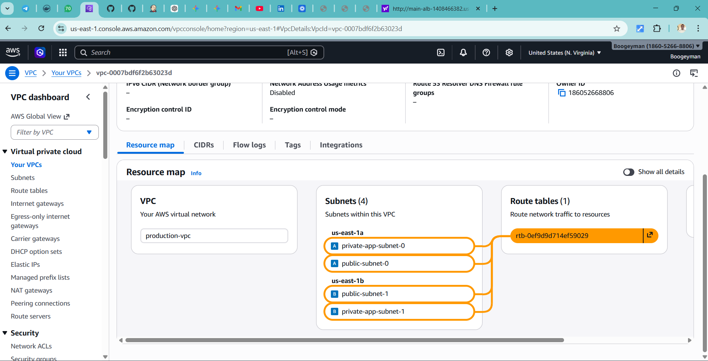
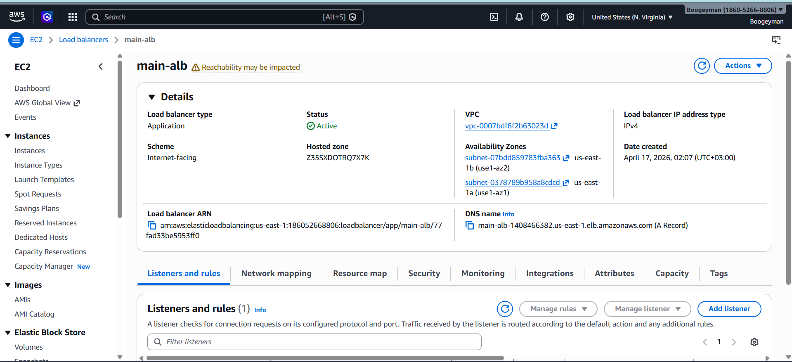
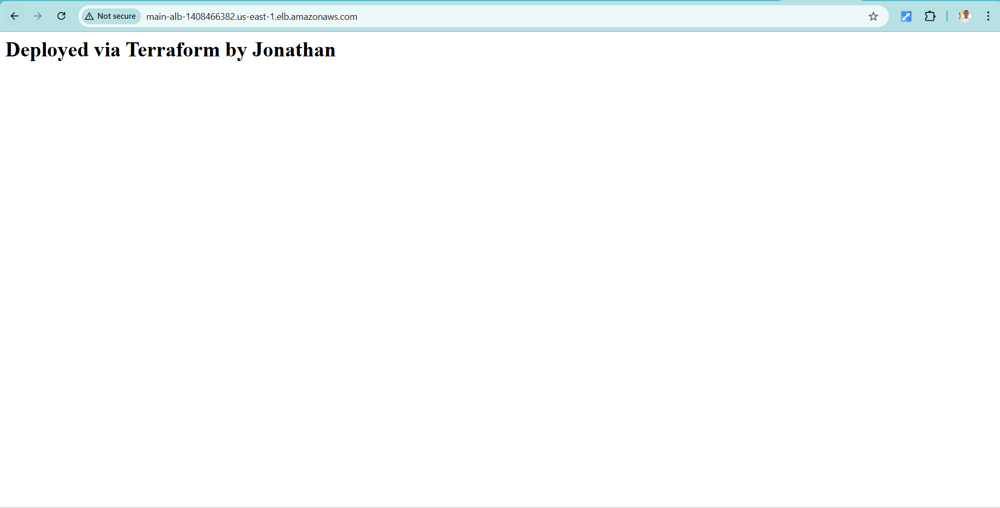

#  AWS Enterprise Terraform Platform
Built a production-ready AWS infrastructure platform using Terraform, enabling automated, scalable, and repeatable deployments. Reduced manual provisioning complexity by implementing modular infrastructure components (VPC, ALB, ASG, security) and centralized remote state management. Demonstrates real-world DevOps workflows, infrastructure lifecycle management, and cloud best practices.


---

#  Architecture Overview

 *High-level architecture of the deployed infrastructure*


> The system deploys a highly available web infrastructure using AWS services across multiple Availability Zones.

---

## 1️ Case Study

##  Problem Statement  
In many organizations, infrastructure is:
- Manually provisioned
- Inconsistent across environments
- Hard to scale and maintain
- Prone to configuration drift

This leads to:
- Deployment failures  
- Security misconfigurations  
- Lack of reproducibility  
- Slow development cycles  

---

##  Solution

This project implements a **modular Infrastructure as Code (IaC) solution using Terraform** to:

- Standardize infrastructure deployment  
- Enable high availability and scalability  
- Enforce best practices (modularity & reusability)  
- Simulate real-world DevOps environments  

---

##  Objectives

- Build a modular Terraform architecture  
- Implement remote state (S3 + DynamoDB)  
- Deploy scalable AWS infrastructure  
- Follow production-level DevOps practices  

---

## 2️⃣ Prerequisites

##  AWS Account
👉 https://aws.amazon.com/free/
##  Required Tools & installations

| Tool | Link |
|------|------|
| Terraform | https://developer.hashicorp.com/terraform/downloads |
| AWS CLI | https://docs.aws.amazon.com/cli/latest/userguide/getting-started-install.html |
| Git | https://git-scm.com/downloads |
| VS Code | https://code.visualstudio.com/ |
| WSL | https://learn.microsoft.com/en-us/windows/wsl/install |
---

## 3️⃣ Configurations
##  AWS CLI Complete Configuration Guide

### Step 1 — Create IAM User

1. Go to AWS Console → IAM  
2. Click **Users → Create user**  
3. Enter username (e.g., `terraform-user`)  
4. Select:
   - ✔ Programmatic access  

---

### Step 2 — Assign Permissions

Attach policy:

- `AdministratorAccess` *(for learning projects)*  

 In production, use least privilege.

---

### Step 3 — Create Access Keys

After user creation:

1. Go to **Security credentials**
2. Click **Create access key**
3. Choose:
   - CLI
4. Copy:

```
Access Key ID
Secret Access Key
```

---

### Step 4 — Configure AWS CLI

Run:

```bash
aws configure
```

Then enter:

```text
AWS Access Key ID [None]: YOUR_ACCESS_KEY
AWS Secret Access Key [None]: YOUR_SECRET_KEY
Default region name [None]: us-east-1
Default output format [None]: json
```

---

### Step 5 — Verify Configuration

Run:

```bash
aws sts get-caller-identity
```

Expected output:

```json
{
  "UserId": "XXXXXXXX",
  "Account": "XXXXXXXX",
  "Arn": "arn:aws:iam::XXXXXXXX:user/terraform-user"
}
```

---

### Step 6 — Check Configuration File (Optional)

```bash
cat ~/.aws/credentials
```

```ini
[default]
aws_access_key_id=YOUR_ACCESS_KEY
aws_secret_access_key=YOUR_SECRET_KEY
```

---

### Step 7 — Check Config File

```bash
cat ~/.aws/config
```

```ini
[default]
region=us-east-1
output=json
```

---

###  Security Best Practices

- ❌ Never commit credentials to GitHub  
- ❌ Do not hardcode keys in Terraform  
- ✔ Use environment variables or IAM roles in production  

---

###  Optional (Better Practice)

Use environment variables instead:

```bash
export AWS_ACCESS_KEY_ID=your_key
export AWS_SECRET_ACCESS_KEY=your_secret
export AWS_DEFAULT_REGION=us-east-1
```
 Remote Backend Setup

 Navigate:
```bash
cd bootstrap/
```

Run:
```bash
terraform init
terraform apply
```


 **Backend Resources**



---

##  Variables Configuration

Update:

```hcl
region         = "your-region"
bucket_name    = "your-unique-bucket-name"
table_name     = "your-dynamodb-table"
```

---

##  Important Notes

- Ensure **globally unique S3 bucket name**
- Replace AMI IDs if needed
- Never expose credentials

---

## 4️⃣ Deployment Guide

##  Step 1
```bash
cd environments/prod
```
---

##  Step 2
```bash
terraform init
```
---

##  Step 3
```bash
terraform validate
```
---

##  Step 4
```bash
terraform plan
```

---

##  Step 5
```bash
terraform apply
```

Type:
```
yes
```

  #  Deployment Demo

Watch the full Terraform deployment in action:

👉 [Click to Watch Demo](https://your-video-link-here)

> This demo shows:
> - terraform init
> - terraform plan
> - terraform apply
> - Successful infrastructure provisioning

---

#  Deployment Evidence

##  Infrastructure Overview

| Service | Screenshot |
|--------|-----------|
| **VPC** |  |
| **Subnets** |  |
| **EC2 (Auto Scaling)** |  |
| **Load Balancer (ALB)** |  |

---

##  Terraform Execution

| Step | Screenshot |
|------|-----------|
| **Plan Output** |  |
| **Apply Output** |  |

---

##  Application Access

| Description | Screenshot |
|------------|-----------|
| **App running via ALB DNS** |  |

---

> All resources shown are provisioned using Terraform and verified via AWS Console.

---

#  Project Structure
```
terraform-aws-enterprise-stack/
├── .github/
│   └── workflows/
│       ├── tf-plan.yml            # CI: Validates code & runs 'plan' on Pull Requests
│       └── tf-apply.yml           # CD: Deploys to AWS on Merge to Main
├── bootstrap/                     # THE "STEP 0" (Run once manually)
│   ├── main.tf                    # Creates S3 Bucket & DynamoDB for Remote State
│   ├── outputs.tf
│   └── variables.tf
├── modules/                       # REUSABLE LEGO BRICKS (Generic & Clean)
│   ├── vpc/
│   │   ├── main.tf                # VPC, Subnets, IGW, NAT, Flow Logs
│   │   ├── outputs.tf
│   │   └── variables.tf
│   ├── security/
│   │   ├── main.tf                # Security Groups & WAF Rules
│   │   ├── outputs.tf
│   │   └── variables.tf
│   ├── compute/
│   │   ├── main.tf                # ASG, Launch Templates, IAM Instance Profiles
│   │   ├── outputs.tf
│   │   └── variables.tf
│   ├── load_balancer/
│   │   ├── main.tf                # ALB, Listeners, Target Groups
│   │   └── outputs.tf
│   └── rds/
│       ├── main.tf                # Aurora or RDS Instance (Multi-AZ)
│       └── variables.tf
├── environments/                  # LIVE DEPLOYMENTS (Where the magic happens)
│   ├── prod/
│   │   ├── backend.tf             # Points to the S3 bucket from 'bootstrap'
│   │   ├── main.tf                # MODULE COMPOSITION (Calls the modules above)
│   │   ├── outputs.tf             # High-level outputs (ALB DNS Name)
│   │   ├── terraform.tfvars       # Production-specific values (e.g., t3.medium)
│   │   └── variables.tf
│   └── staging/                   # (Optional) Same as prod but with t3.micro
├── scripts/                       # TOOLING
│   ├── check-format.sh            # Pre-commit hook to run 'terraform fmt'
│   └── cleanup-leaked-keys.py     # Shows security-mindedness
└── README.md                      # YOUR RESUME (Architecture diagrams & Docs)
```

---

## 5️⃣ Learnings & Challenges

##  Key Learnings

- Modular Terraform design  
- Remote state management  
- AWS networking (VPC, subnets, IGW)  
- Load balancing & scaling  
- Debugging real-world Terraform issues  

---

##  Challenges

### 🔹 WSL vs Windows filesystem  
✔ Fixed by using WSL-native paths  

### 🔹 Terraform state conflicts  
✔ Learned `terraform import` vs recreate  

### 🔹 Module path errors  
✔ Fixed structure and references  

### 🔹 AWS authentication issues  
✔ Resolved with proper CLI config  

---

## 6️⃣ Conclusion

This project demonstrates a **production-ready AWS infrastructure using Terraform**, applying:

- Infrastructure as Code best practices  
- Modular architecture design  
- Environment-based deployment strategy  
- Real-world DevOps workflows  

---

##  Future Improvements

-  HTTPS with ACM  
-  Route53 domain integration  
-  CI/CD with GitHub Actions  
-  Monitoring with CloudWatch  
-  Advanced security (WAF, IAM hardening)  

---

## Cleanup (Important)

To avoid unnecessary AWS charges, make sure to destroy all provisioned resources after testing.

##  Run:

```bash
terraform destroy
```

Type:

```
yes
```

---

##  Why this matters

- Prevents unexpected AWS costs   
- Ensures clean teardown of infrastructure  
- Reinforces Infrastructure as Code best practices  

---

##  Note

Terraform will remove:
- EC2 instances  
- Load Balancer (ALB)  
- VPC and networking resources  
- Any associated components  

---

>  Always run `terraform destroy` when you're done experimenting or testing.
#  Final Thought

This project reflects how modern cloud infrastructure is designed, automated, and managed in real-world DevOps environments.

---

## ⭐ If you found this useful, consider giving the repo a star!

